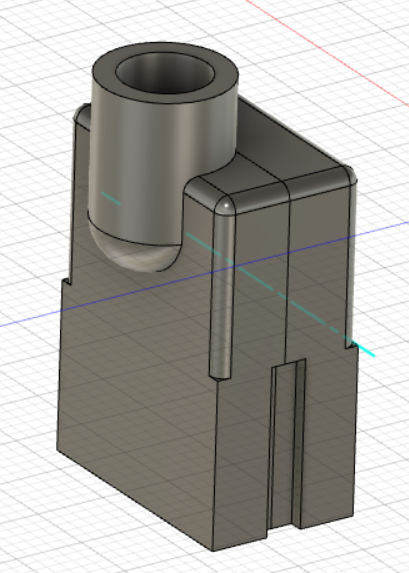

# game.link
An open-source DIY link cable for the Tiger game.com handheld.

## Wiring
You can use an Ethernet cable as a "base" and cut off the connectors.
The Ethernet cable has 8 wires, but you only need 7, so you can remove one.
Push the Ethernet cable already through the connector part and then solder onto the PCB.
**The PCB side with 4 connector pads to the game.com link port needs to face towards the Ethernet cable shell part.**
Connect the solder pads as follows between the two ends:

| **Pad End A** | **Pad End B**|
|---------------|----------|
| U1 | U8 |
| U3 | U3 |
| U5 | U6 |
| U6 | U5 |
| U7 | U9 |
| U8 | U1 |
| U9 | U7 |

Pads U2 and U4 remain unconnected.
Many thanks to Xiden for providing the pinout of the original compete.com link cable!

## PCB
The PCB is 4 layer and should be ordered with ENIG.

## Shell STL
The STL files for the shell can be found inside the STL folder.
I'm not 100% happy with the design/fit, but it's working for me.
Anybody who is eager tweak it is obviously welcome to improve it :) .

## Disclaimer
**Use the files to build your own link cable at your own risk**.
This adapter works fine for me, but it's a simple hobby project, so there is no liability for errors in the board files and/or shell design.
**Use at your own risk**.
